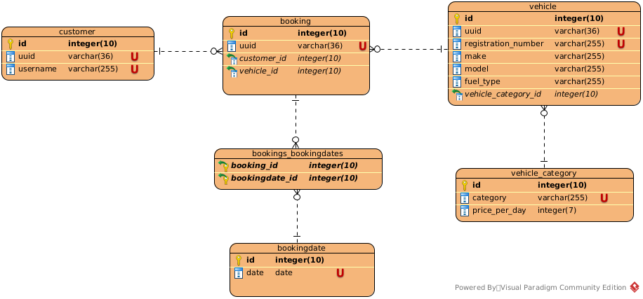

## Vehicle Hire Booking System

This is a system for a vehicle hire company. The system keeps
a record of the vehicles the company owns and which ones are 
currently hired out to customers. The service is designed to be GMT timezone based.
It uses H2 in memory database, the data is not persisted between multiple runs. 

### Database schema

The following schema represents the system's entities and the relations 
between them.



### How to run the service

1. clone the repository
2. cd into project directory
3. build ```mvn clean package spring-boot:repackage```
4. run ```java -jar target/vbs-0.0.1-SNAPSHOT.jar```

While the application is running it is possible to access [http://localhost:8080/h2-console](http://localhost:8080/h2-console)
and take a look in the database. In the database should be already persisted
3 vehicles, 1 customer, 3 vehicle categories, 2 bookings and 2 booking dates. 
Vehicle registration number should respect the following regular expression ```^[A-Z]{3} [0-9]{3}$```. 
Examples of valid registration numbers are ```ABC 123``` and ```VFG 535```. 

#### H2 database credentials

Driver Class: org.h2.Driver

* JDBC URL: jdbc:h2:mem:vbs_db
* User Name: vbs
* Password: password

### OpenAPI definition

The endpoints are listed on [http://localhost:8080/swagger-ui/index.html](http://localhost:8080/swagger-ui/index.html). 
You can use Swagger to test the endpoints.

